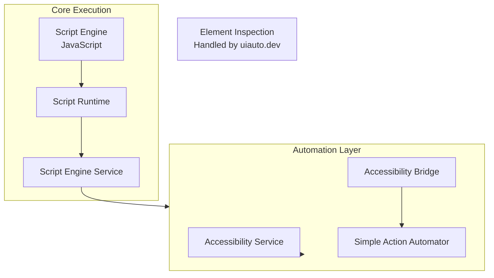

# AutoCLJS Essential Features Port Plan

## Goal

Create autocljs - a ClojureScript library for Android automation by porting essential features from AutoX.js. Focus on minimal viable features: script execution and basic automation (coordinate-based clicks). Element inspection will be handled by uiauto.dev, so Phase 3 is not needed.

**Architecture Note**: ClojureScript is compiled to JavaScript before reaching this library. The library executes compiled JavaScript code and provides Android APIs to the JavaScript runtime.

## Project Structure

All ported code will be placed in a new module: **`app1/`**

This keeps the ported autocljs code separate from the original AutoX.js codebase. The structure will follow Android module conventions:

- `app1/src/main/java/` - Java/Kotlin source code
- `app1/src/main/res/` - Android resources
- `app1/build.gradle.kts` - Module build configuration

## Architecture Overview

## Phase 1: Script Execution (Hello World)

### Goal

Execute a simple compiled JavaScript script (from ClojureScript) that prints "Hello World" to console.

**Status**: ✅ **COMPLETED**

### Completed Components

- ✅ ScriptEngine interface and AbstractScriptEngine base class
- ✅ ScriptSource and StringScriptSource (receives compiled JavaScript)
- ✅ Console interface and SimpleConsole implementation
- ✅ Minimal ScriptRuntime with Console API
- ✅ ClojureScriptEngine (JavaScript engine placeholder)
- ✅ ScriptEngineService with singleton engine pattern
- ✅ Example code demonstrating usage

**Note**: The engine currently logs script execution. JavaScript engine integration (Rhino, V8, etc.) is the next step to actually execute code.

### Essential Components

#### 1.1 Script Engine Interface

- **File**: [autojs/src/main/java/com/stardust/autojs/engine/ScriptEngine.kt](autojs/src/main/java/com/stardust/autojs/engine/ScriptEngine.kt)
- **What to port**: 
  - `ScriptEngine` interface (execute, destroy, lifecycle)
  - `AbstractScriptEngine` base class
- **For JavaScript**: Create equivalent interface that can execute compiled JavaScript code (ClojureScript is compiled elsewhere)

#### 1.2 Script Runtime (Minimal)

- **File**: [autojs/src/main/java/com/stardust/autojs/runtime/ScriptRuntime.java](autojs/src/main/java/com/stardust/autojs/runtime/ScriptRuntime.java)
- **What to port**:
  - Basic runtime initialization
  - Console API binding
  - Global scope setup
- **Skip**: Most API modules (UI, Images, etc.) - add only Console

#### 1.3 Console API

- **File**: [autojs/src/main/java/com/stardust/autojs/runtime/api/Console.java](autojs/src/main/java/com/stardust/autojs/runtime/api/Console.java)
- **What to port**:
  - `log()`, `info()`, `warn()`, `error()` methods
  - Basic console output
- **Skip**: Floating console windows, auto-hide features

#### 1.4 Script Execution Service

- **File**: [autojs/src/main/java/com/stardust/autojs/ScriptEngineService.kt](autojs/src/main/java/com/stardust/autojs/ScriptEngineService.kt)
- **What to port**:
  - `execute()` method
  - Script execution lifecycle
  - Basic error handling
- **Skip**: Complex execution modes, activity-based execution

#### 1.5 Script Source

- **Files**: 
  - [autojs/src/main/java/com/stardust/autojs/script/ScriptSource.kt](autojs/src/main/java/com/stardust/autojs/script/ScriptSource.kt)
  - [autojs/src/main/java/com/stardust/autojs/script/JavaScriptFileSource.kt](autojs/src/main/java/com/stardust/autojs/script/JavaScriptFileSource.kt)
  - [autojs/src/main/java/com/stardust/autojs/script/StringScriptSource.kt](autojs/src/main/java/com/stardust/autojs/script/StringScriptSource.kt)
- **What to port**: Script source abstraction for loading compiled JavaScript files/strings

### Implementation Steps

1. ✅ Create JavaScript engine wrapper (similar to RhinoJavaScriptEngine) - **DONE**
2. ✅ Implement minimal ScriptRuntime with Console only - **DONE**
3. ✅ Create ScriptEngineService that can execute JavaScript - **DONE**
4. ⏳ Integrate actual JavaScript engine (Rhino/V8) to execute code - **TODO**
5. ⏳ Test: Execute compiled JavaScript and see console output - **TODO**

**Current Status**: Infrastructure is complete. Next step is integrating a JavaScript engine (Rhino, V8, or similar) to actually execute the compiled JavaScript code.

### Key Files to Study

- [autojs/src/main/java/com/stardust/autojs/engine/RhinoJavaScriptEngine.kt](autojs/src/main/java/com/stardust/autojs/engine/RhinoJavaScriptEngine.kt) - Engine implementation pattern
- [autojs/src/main/java/com/stardust/autojs/execution/RunnableScriptExecution.java](autojs/src/main/java/com/stardust/autojs/execution/RunnableScriptExecution.java) - Execution pattern

## Phase 2: Basic Automation (Click)

### Goal

Perform click actions on screen coordinates or UI elements.

**Status**: ✅ **COMPLETED**

### Essential Components

#### 2.1 Accessibility Service

- **File**: [automator/src/main/java/com/stardust/view/accessibility/AccessibilityService.kt](automator/src/main/java/com/stardust/view/accessibility/AccessibilityService.kt)
- **What to port**:
  - Service lifecycle (onServiceConnected, onAccessibilityEvent)
  - `getRootInActiveWindow()` - get UI tree
  - Basic event handling
- **Skip**: Gesture handling, key interception (for now)

#### 2.2 Accessibility Bridge

- **File**: [autojs/src/main/java/com/stardust/autojs/core/accessibility/AccessibilityBridge.java](autojs/src/main/java/com/stardust/autojs/core/accessibility/AccessibilityBridge.java)
- **What to port**:
  - Service connection management
  - `ensureServiceEnabled()` - check/enable accessibility
  - `getService()` - get accessibility service instance
  - `rootInActiveWindow()` - get root node
- **Skip**: Window filtering, fast mode, usage stats

#### 2.3 Simple Action Automator

- **File**: [autojs/src/main/java/com/stardust/autojs/core/accessibility/SimpleActionAutomator.kt](autojs/src/main/java/com/stardust/autojs/core/accessibility/SimpleActionAutomator.kt)
- **What to port**:
  - `click(x, y)` - click at coordinates
  - `longClick(x, y)` - long press
  - `press(x, y, duration)` - press and hold
  - `swipe(x1, y1, x2, y2, duration)` - swipe gesture
- **Skip**: Complex gestures, async gestures (for now)

#### 2.4 Global Action Automator

- **File**: [automator/src/main/java/com/stardust/automator/GlobalActionAutomator.kt](automator/src/main/java/com/stardust/automator/GlobalActionAutomator.kt)
- **What to port**:
  - `click(x, y)` implementation using GestureDescription
  - `gesture()` - low-level gesture execution
  - Handler/Looper setup for gesture dispatch
- **Skip**: Async gestures, complex multi-stroke gestures

#### 2.5 Runtime Integration

- **File**: [autojs/src/main/java/com/stardust/autojs/runtime/ScriptRuntime.java](autojs/src/main/java/com/stardust/autojs/runtime/ScriptRuntime.java)
- **What to add**: 
  - `AccessibilityBridge` initialization
  - Expose automator to JavaScript runtime
  - API binding (e.g., `auto.click(x, y)`) - exposed to compiled JavaScript code

### Implementation Steps

1. ✅ Port AccessibilityService (minimal - just connection and root access) - **DONE**
2. ✅ Port AccessibilityBridge (service management) - **DONE**
3. ✅ Port SimpleActionAutomator (click methods) - **DONE**
4. ✅ Port GlobalActionAutomator (gesture execution) - **DONE**
5. ✅ Integrate into ScriptRuntime - **DONE**
6. ⏳ Test: Compiled JavaScript calls `auto.click(500, 500)` to click at coordinates - **TODO** (requires JavaScript engine integration)

### Completed Components

- ✅ AccessibilityService - minimal version with lifecycle and root access
- ✅ AccessibilityBridge - abstract bridge with concrete implementation
- ✅ GlobalActionAutomator - gesture execution using GestureDescription
- ✅ SimpleActionAutomator - coordinate-based click, longClick, press, swipe methods
- ✅ Utility classes - VolatileBox, VolatileDispose, UiHandler, ScreenMetrics, AccessibilityConfig
- ✅ Accessibility service configuration XML
- ✅ ScriptRuntime integration - automator exposed via runtime
- ✅ Example code demonstrating usage

**Note**: The automation infrastructure is complete. Next step is integrating a JavaScript engine to expose the automator API to compiled JavaScript code, and then testing coordinate-based clicks.

### Key Files to Study

- [autojs/src/main/java/com/stardust/autojs/core/accessibility/AccessibilityService.kt](autojs/src/main/java/com/stardust/autojs/core/accessibility/AccessibilityService.kt) - Service wrapper
- [automator/src/main/java/com/stardust/automator/GlobalActionAutomator.kt](automator/src/main/java/com/stardust/automator/GlobalActionAutomator.kt) - Gesture implementation
- [autojs/src/main/res/xml/accessibility_service_config.xml](autojs/src/main/res/xml/accessibility_service_config.xml) - Service configuration

## Phase 3: Element Inspection

**Status**: ❌ **CANCELLED** - Using uiauto.dev for element inspection instead

Element inspection functionality (UiObject, UiSelector, filter system, search algorithms) will not be ported. Users will use uiauto.dev to inspect elements and obtain coordinates/properties, then use those coordinates with the coordinate-based click automation from Phase 2.

## Files to Exclude

### Not Needed for MVP

- **Vue UI Framework**: [autojs/src/main/js/v7-api/src/vue-ui/](autojs/src/main/js/v7-api/src/vue-ui/)
- **ML/OCR**: 
  - [paddleocr/](paddleocr/)
  - [autojs/src/main/java/com/stardust/autojs/core/mlkit/](autojs/src/main/java/com/stardust/autojs/core/mlkit/)
  - [autojs/src/main/java/com/stardust/autojs/onnx/](autojs/src/main/java/com/stardust/autojs/onnx/)
- **Image Processing**: [autojs/src/main/java/com/stardust/autojs/core/image/](autojs/src/main/java/com/stardust/autojs/core/image/) (except basic screenshot if needed)
- **Code Editor**: [codeeditor/](codeeditor/)
- **APK Builder**: [apkbuilder/](apkbuilder/)
- **Shizuku**: [autojs/src/main/java/com/stardust/autojs/core/shizuku/](autojs/src/main/java/com/stardust/autojs/core/shizuku/) (for now)
- **Complex UI APIs**: [autojs/src/main/java/com/stardust/autojs/core/ui/](autojs/src/main/java/com/stardust/autojs/core/ui/) (E4X, etc.)
- **Floating Windows**: [autojs/src/main/java/com/stardust/autojs/core/floaty/](autojs/src/main/java/com/stardust/autojs/core/floaty/) (for now)
- **HTTP/Network**: Can add later if needed
- **File Operations**: Can add later if needed

## Minimal Dependencies

### Required Modules

- `automator` - UI automation core
- `autojs` - Script runtime (minimal subset)
- `common` - Basic utilities (only what's needed)

### Android Permissions Needed

- `BIND_ACCESSIBILITY_SERVICE` - For accessibility service
- Basic app permissions

## Study Order

1. **Script Execution Flow**: Understand how scripts are loaded and executed

   - ScriptEngine → ScriptRuntime → Execution

2. **Accessibility Service**: How it connects and provides UI access

   - AccessibilityService → AccessibilityBridge → Root access

3. **Click Implementation**: How gestures are performed

   - SimpleActionAutomator → GlobalActionAutomator → GestureDescription

## Next Steps After MVP

Once basic features work:

- Add more actions (swipe, scroll, etc.)
- Add screenshot capability
- Add file I/O for scripts
- Add error handling and logging
- Integrate JavaScript engine (Rhino/V8) to execute compiled JavaScript code

## Key Implementation Notes

1. **JavaScript Execution**: ClojureScript is compiled to JavaScript elsewhere. This library executes the compiled JavaScript and exposes Android APIs to it. Need to integrate a JavaScript engine (Rhino, V8, etc.) in the engine implementation.
2. **API Exposure**: Need to create Java/Kotlin interop layer to expose APIs to the JavaScript runtime (similar to how AutoX.js exposes APIs to Rhino).
3. **Threading**: Most automation operations need to run on main/UI thread
4. **Accessibility Service**: Must be enabled in Android settings before use
5. **Error Handling**: Accessibility operations can fail silently - need proper error checking
6. **Node Lifecycle**: AccessibilityNodeInfo objects are recycled - need to copy data immediately

## Phase 1 Completion Summary

✅ **Infrastructure Complete**:
- Script execution framework
- Console API
- Script source handling
- Service layer

⏳ **Next Step**: Integrate JavaScript engine (Rhino/V8) to actually execute compiled JavaScript code