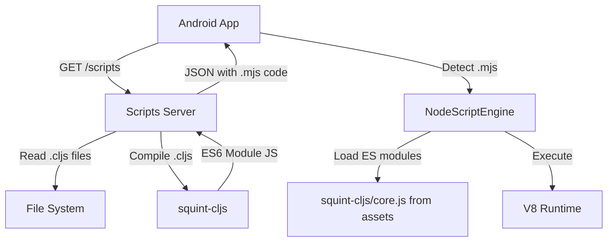

# Integrate squint-cljs with Node.js Engine Support

## Overview

Enable squint-cljs compilation with native ES6 module support by using `NodeScriptEngine` (Javet/V8) instead of Rhino. This eliminates the need for bundling since NodeScriptEngine natively supports ES modules. The server will compile `.cljs` files to ES modules, and the Android app will execute them using NodeScriptEngine.

## Key Insight

AutoX v7 uses `NodeScriptEngine` (based on Javet/V8) for `.mjs`, `.cjs`, and `.node.js` files, which natively supports ES6 modules. This means:

- No bundling needed - ES modules work directly
- `squint-cljs/core.js` can be included as an asset or served from the server
- Node.js built-ins can be polyfilled or stubbed in the Node.js runtime environment

## Architecture



## Implementation Plan

### 1. Add NodeScriptEngine to app1 Module

**Files**: `app1/build.gradle.kts`, `app1/src/main/java/com/autocljs/engine/NodeScriptEngineWrapper.kt` (new)

- Add Javet dependency to `app1/build.gradle.kts`:
  ```kotlin
  implementation("com.caoccao.javet:javet-node-android:5.0.2")
  ```

- Create `NodeScriptEngineWrapper.kt` that:
  - Wraps or adapts the NodeScriptEngine from autojs module, OR
  - Creates a simplified NodeScriptEngine implementation for app1
  - Exposes `console` and `auto` APIs similar to ClojureScriptEngine
  - Supports ES module execution

### 2. Update ScriptSource to Support Node.js Engine

**Files**: `app1/src/main/java/com/autocljs/script/StringScriptSource.kt`, `app1/src/main/java/com/autocljs/script/NodeScriptSource.kt` (new)

- Create `NodeScriptSource.kt` for ES module scripts:
  ```kotlin
  class NodeScriptSource(name: String, val script: String) : ScriptSource(name) {
      override val engineName: String = "com.autocljs.engine.NodeScriptEngine"
  }
  ```

- Or modify `StringScriptSource` to detect `.mjs` extension and set appropriate engine name
- Update `ScriptEngineService` to support multiple engines based on `ScriptSource.engineName`

### 3. Include squint-cljs Runtime in Android Assets

**Directory**: `app1/src/main/assets/squint-runtime/` (new)

- Copy `squint-cljs/core.js` from `node_modules` to assets
- Or create a script to download/bundle it during build
- Configure NodeScriptEngine's module resolver to load from assets

### 4. Server-Side Compilation (Simplified)

**Files**: `package.json` (new), `scripts-server.js` (updated)

- Create `package.json` with `squint-cljs` dependency
- Update `scripts-server.js` to:
  - Compile `.cljs` files using squint-cljs (outputs ES modules)
  - Return compiled code with `.mjs` extension indicator
  - No bundling needed - ES modules work directly with NodeScriptEngine
  - Optionally serve `squint-cljs/core.js` as a separate endpoint if not in assets

### 5. Update ScriptEngineService

**File**: `app1/src/main/java/com/autocljs/ScriptEngineService.kt`

- Support multiple engines:
  - Rhino engine for `.js` files (backward compatibility)
  - NodeScriptEngine for `.mjs` files (ES modules)
- Engine selection based on `ScriptSource.engineName` or file extension
- Initialize both engines or lazy-load as needed

### 6. Example ClojureScript Files

**Files**: `scripts/example.cljs`, `scripts/automation-example.cljs`

- Create examples that compile to ES modules
- Use `import` statements for squint-cljs/core.js
- Demonstrate `console` and `auto` API usage

## Technical Details

### NodeScriptEngine Integration

Since `NodeScriptEngine` exists in the `autojs` module, we have two options:

**Option A**: Add dependency on `autojs` module (if allowed)

- Simple but creates dependency

**Option B**: Create a simplified NodeScriptEngine in `app1` module

- More work but keeps app1 independent
- Can reuse patterns from autojs module

**Option C**: Extract NodeScriptEngine to a shared module

- Best long-term but more refactoring

### Module Resolution

NodeScriptEngine needs to resolve `squint-cljs/core.js`. Options:

1. **Assets approach**: Include in `app1/src/main/assets/squint-runtime/` and configure module resolver
2. **Server approach**: Serve from scripts server, configure module resolver to fetch from HTTP
3. **Hybrid**: Check assets first, fallback to HTTP

### File Structure

```
project-root/
├── scripts-server.js (updated - compile to ES modules)
├── package.json (new)
├── scripts/
│   ├── example.cljs (new)
│   └── automation-example.cljs (new)
└── app1/
    ├── build.gradle.kts (add Javet dependency)
    ├── src/main/
    │   ├── assets/
    │   │   └── squint-runtime/
    │   │       └── core.js (squint-cljs runtime)
    │   └── java/com/autocljs/
    │       ├── engine/
    │       │   └── NodeScriptEngineWrapper.kt (new)
    │       ├── script/
    │       │   └── NodeScriptSource.kt (new)
    │       └── ScriptEngineService.kt (updated)
```

### API Compatibility

Server returns JSON with ES module code:

```json
[
  {
    "name": "Script Name",
    "code": "import * as squint_core from 'squint-cljs/core.js';\n...",
    "type": "mjs"  // Indicates Node.js engine
  }
]
```

Android app detects type and uses appropriate engine.

## Implementation Steps

1. **Add Javet dependency** to app1/build.gradle.kts
2. **Create NodeScriptEngineWrapper** in app1 module
3. **Create NodeScriptSource** for ES module scripts
4. **Update ScriptEngineService** to support multiple engines
5. **Include squint-cljs/core.js** in Android assets
6. **Update server** to compile .cljs to ES modules
7. **Create example .cljs files**
8. **Test ES module execution** in Android app

## Testing

- Verify `.cljs` files compile to ES modules with squint-cljs
- Verify NodeScriptEngine loads and executes ES modules
- Verify `squint-cljs/core.js` is resolved from assets
- Test with both automation and non-automation scripts
- Ensure backward compatibility with existing `.js` files (Rhino)